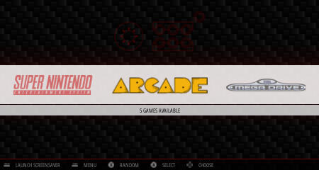
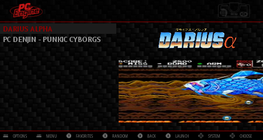

# Retropie + Retrotink Ultimate Setup

This repo contains configurations and helper scripts for configuration a fresh Retropie
installation to use the Retrotink Ultimate (http://www.retrotink.com/) for analog video
output. Some of the configs in this repo were taken from https://github.com/Vykyan/retroTINK-setup.

The configurations in this repo have been modified based on my testing, and this is what I've gotten to work with my Toshiba CRT TV. I've included a theme that is based on the carbon-nometa built-in theme that omptizes some things for CRT's- this theme will be enabled automatically when the setup script is run.

## How to use this repo
- Install RetroPie image and enable SSH (See RetroPie docs)
- SSH into your pi and run the following:
```
git clone https://github.com/robbydyer/retropie-retrotink-setup.git
cd retropie-retrotink-setup
sudo ./setup.sh
sudo reboot
```

It's not technically idempotent, but it is safe to run `setup.sh` repeatedly. Just be aware that any changes you might have made to *any* of the files in `files/` will be overwritten with the defaults in the repository.

## Extras
There are a few helper scripts I've added [here](files/usr/local/bin)

These scripts are all installed into `/usr/local/bin` by the setup script, so they can be called without a fully qualified path.

- `resize-video FILENAME` - A helper script to resize an mp4 video to 320x240.
- `resize-all-videos` - Resizes all `*.mp4` videos scraped via the scraper and stored in `/home/pi/.emulationstation/downloaded_images`
- `run-scraper` - Runs Steven Selpth's Scraper for all systems (see https://github.com/RetroPie/RetroPie-Setup/wiki/scraper#steven-selphs-scraper for installation information). Downloads mp4 videos, which can then be resized with above scripts.
- `restart-emulationstation` - Restarts emulationstation. Helpful when modifying configs

## Theme Screenshots


